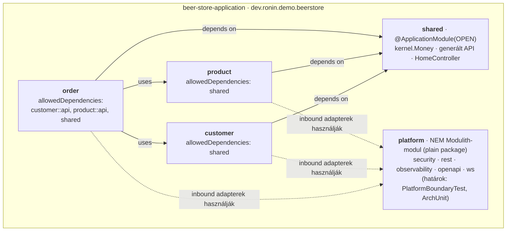
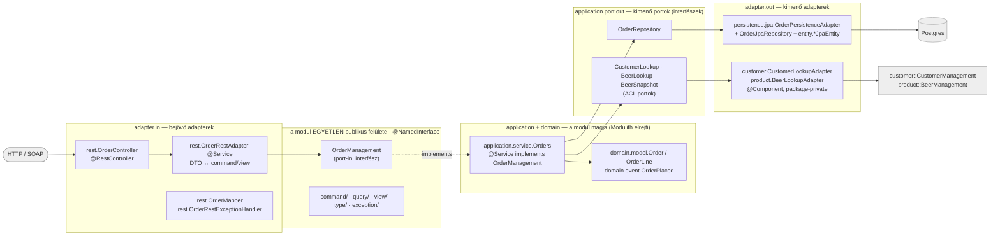
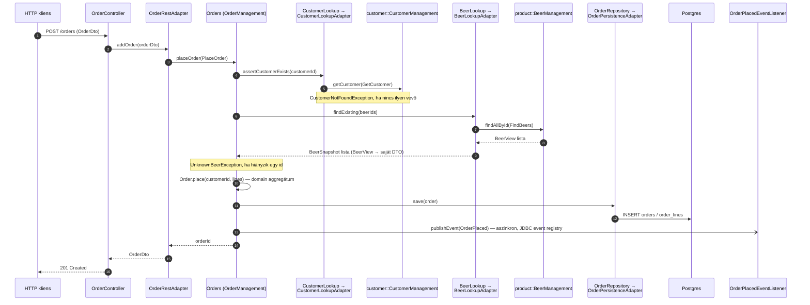
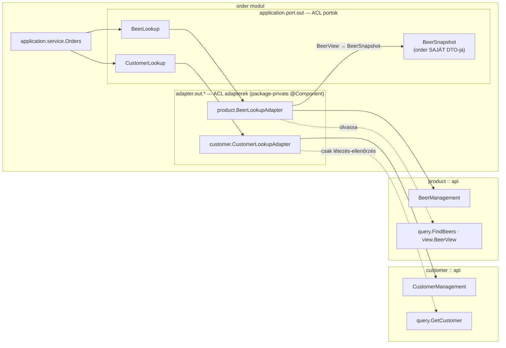

# Architektúra-diagramok

Ez a dokumentum a `beer-store-application` belső architektúráját vizualizálja Mermaid ábrákkal:
hogyan működik a Spring Modulith modulfelosztás, mire való az egyes package, és hogyan halad a
kommunikáció a portokon keresztül modulon belül és modulok között.

**Viszonya a generált dokumentációhoz:** a Spring Modulith `Documenter` API
(`architecture/ModularityTests.writesDocumentation()`) minden build futtatáskor legenerálja a
modul-térkép C4-PlantUML változatát a `beer-store-application/target/spring-modulith-docs/`
alá (`components.puml`, `module-*.puml`) — ez git-ignore-olt, gépi generált, és csak modul
szintű. Az itt található ábrák **nem váltják ki**, hanem kiegészítik azt: az 1. ábra a generált
modul-térkép GitHub-on olvasható, annotált párja, a 2–4. ábra pedig olyan mélységet mutat be
(package-szerepek, konkrét kérésfolyam, ACL-kommunikáció), amit a generált diagram nem tartalmaz.
Ezeket kézzel kell karban tartani — lásd a dokumentum végén a Karbantartás szakaszt.

A modulok és rétegek elnevezési konvencióját a gyökér `CLAUDE.md` "Spring Modulith module layout"
és "Naming & convention cheat-sheet" szakaszai írják le részletesen; ez a dokumentum azokra épül.

---

## 1. ábra — Modul-térkép (a modulith működés áttekintése)

A négy `@ApplicationModule` modul — `customer`, `product`, `order`, `shared` — és a `platform`
package, ami **szándékosan nem** Modulith-modul (`spring.modulith.detection-strategy=explicitly-annotated`,
lásd ADR-04). Az élek az egyes `package-info.java`-kban deklarált `allowedDependencies`
értékeket mutatják: `order` kizárólag a `customer::api` és `product::api` named interface-eken
át függ a másik két üzleti modultól (sosem a domainjükön), mindhárom üzleti modul függ a nyitott
(`OPEN`) `shared` modultól, a `platform` pedig egy keresztmetsző technikai package, amit a
bejövő adapterek használnak (biztonság, hibakezelés, megfigyelhetőség), de ami maga sosem
függ vissza egy üzleti modulra — ezt a határt nem a Modulith `verify()`, hanem külön ArchUnit
szabályok (`PlatformBoundaryTest`) őrzik.



## 2. ábra — Hexagonális port-metszet + package-szerepek

Egy modul (példa: `order`) teljes ports-and-adapters gyűrűje, minden csomópont felcímkézve a
package-ével és a szerepével. Ez válaszolja meg egyszerre, hogy "melyik package mire való" és
"hogyan halad a kommunikáció a portokon": bejövő adapter → `api` (a modul egyetlen publikus
felülete) → mag (`application.service` + `domain`, amit a Modulith alapból elrejt) → kimenő
portok (`application.port.out`, interfészek) → kimenő adapterek. A `customer` és `product`
modul ugyanilyen alakú (a `customer` emellett egy `adapter.in.soap` bejövő adaptert is tartalmaz
a SOAP végponthoz).



## 3. ábra — Rendelés végigfutása a portokon (sequence)

A `placeOrder` konkrét, végponttól végpontig tartó folyamata — ez teszi kézzelfoghatóvá, hogy a
service (`Orders`) sosem hív közvetlenül idegen modult, hanem kizárólag a saját kimenő
portjain (`CustomerLookup`, `BeerLookup`) keresztül, és hogy az `OrderPlaced` esemény a
Spring Modulith JDBC event-publication registryn át, aszinkron, modulon belül fut le. A
lépéssorrend 1:1 megfelel az `order/application/service/Orders.java` `placeOrder` metódusának.



## 4. ábra — Modulközi ACL kommunikáció

Ráközelít arra, hogyan éri el az `order` modul a `customer`/`product` modulokat **kizárólag** a
saját kimenő ACL portjain (`CustomerLookup`, `BeerLookup`) és azok package-private adapterein
keresztül, sosem importálva a másik modul domain típusait. Az adapter fordítja le az idegen
`BeerView`-t az `order` saját `BeerSnapshot` DTO-jára, így egy `BeerView` mezőváltozás csak az
adapterig gyűrűzik be, a service-t és a domaint nem érinti (lásd ADR-01).



---

## Karbantartás

Ezek az ábrák **kézzel karbantartottak**, nem generáltak — ha a modul-wiring változik, itt is
frissíteni kell őket. Forrás, amivel egyeztetni kell módosításkor:

- **1. ábra** a `customer`, `product`, `order`, `shared` modulok `package-info.java` fájljainak
  `allowedDependencies` értékét tükrözi, és a `ModularityTests.writesDocumentation()` által
  generált `target/spring-modulith-docs/components.puml` annotált párja.
- **2. és 4. ábra** az `order` modul teljes forrásfáját tükrözi: `order/api/OrderManagement.java`,
  `order/application/service/Orders.java`, `order/application/port/out/*.java`,
  `order/adapter/in/rest/*.java`, `order/adapter/out/**/*.java`. A `CLAUDE.md`
  "Module reference" táblázata (`customer` / `product` / `order` oszlopok) ugyanezt a
  réteg-per-réteg felsorolást adja meg minden modulra — ha a tábla változik, ez a két ábra is
  frissítendő.
- **3. ábra** kifejezetten az `Orders.placeOrder` metódus lépéssorrendjét követi
  (`order/application/service/Orders.java`) — metódus-átnevezés vagy lépéssorrend-változás esetén
  frissítendő.

Renderelés ellenőrzése: bármely Mermaid-kompatibilis megjelenítő (GitHub natívan rendereli a
`.md` fájlban a ```mermaid blokkokat; helyben VS Code Mermaid-preview vagy a mermaid.live
szerkesztő is használható).
